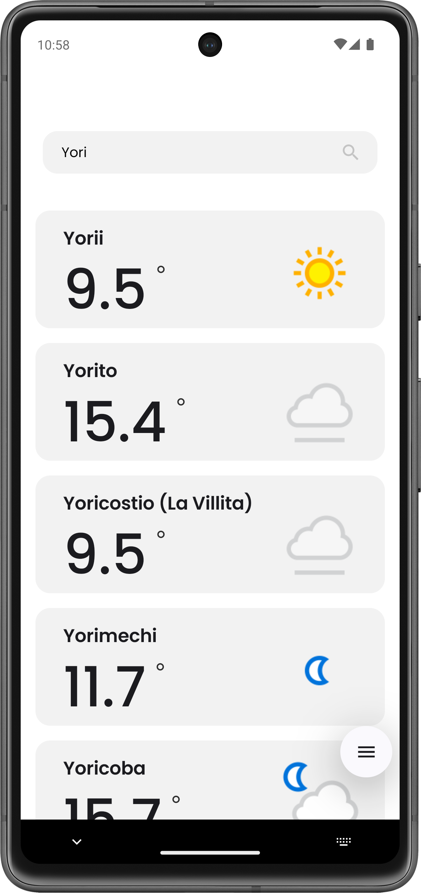

# Weather App

<div style="display: flex; justify-content: space-between;">
    
    
    
</div>

This is a Weather App built using Jetpack Compose, Kotlin, and Android Studio. The app provides current weather information for a specified city.

## Features

- Display current temperature with a degree icon
- Show error messages using Snackbar for network issues and invalid city names

## Project Setup

### Prerequisites

- Android Studio Ladybug | 2024.2.1 Patch 3
- Kotlin 1.8.0 or higher
- Gradle 7.0 or higher

### Clone the Repository

```sh
git clone https://github.com/rishirajput/Weather-Android-App
cd weather-app
```

### Provide Weather API Key

To provide the Weather API key, you have the following options:

1. **Via Android Studio Settings**:
    - Go to `Android Studio -> Settings -> Build, Execution, Deployment -> Gradle-Android-Compiler`
    - Enter the following in the command line options: `-PweatherApiKey=YOUR_API_KEY`

2. **Via `local.properties` File**:
    - Open `local.properties` file in the root of your project and add the following line:
    ```properties
    weatherApiKey=YOUR_API_KEY
    ```

3. **Via Command Line**:
    - Pass the API key as a command line option when building or running the project:
    ```sh
    ./gradlew assembleDebug -PweatherApiKey=YOUR_API_KEY
    ```

### Build and Run the Project

1. Open the project in Android Studio.
2. Sync the project with Gradle files.
3. Build and run the project on an emulator or physical device.

## Architecture

This project follows Clean Architecture principles with MVVM (Model-View-ViewModel) pattern to ensure clean, modular, and testable code. The architecture is divided into three main layers:

1. **Presentation Layer**: Contains UI components and ViewModels.
2. **Domain Layer**: Contains business logic and use cases.
3. **Data Layer**: Contains data sources and repositories.

### Presentation Layer

- **ViewModel**: Manages UI-related data and handles user interactions.
- **Composable Functions**: Define the UI components using Jetpack Compose.

### Domain Layer

- **Use Cases**: Encapsulate business logic and interact with repositories.
- **Entities**: Represent core business objects.

### Data Layer

- **Repositories**: Provide data from various sources (e.g., network, database).
- **Data Sources**: Handle data operations (e.g., API calls, database queries).

### Example

Here is an example of how the layers interact:

- **ViewModel**: Fetches weather data using a use case and exposes it to the UI.
- **Use Case**: Retrieves weather data from the repository.
- **Repository**: Fetches weather data from a remote data source (e.g., API).

### Dependency Injection

This project uses Koin for dependency injection.

## Testing

### Unit Tests

To run unit tests, use the following command:

```sh
./gradlew testDebugUnitTest
```

### UI Tests

To run UI tests, use the following command:

```sh
./gradlew connectedAndroidTest
```

## License

This project is licensed under the MIT License. See the `LICENSE` file for more details.
